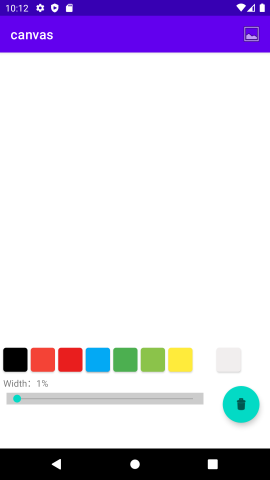
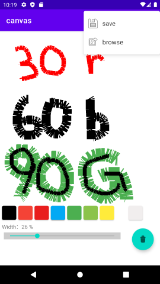
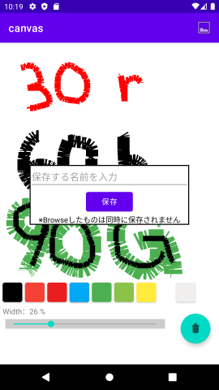
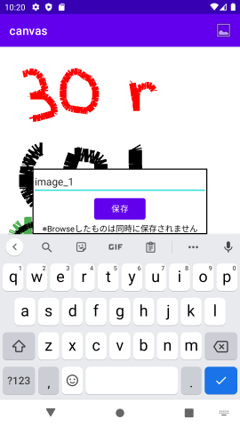
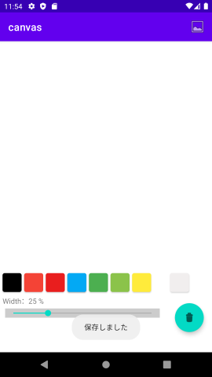
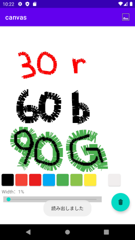
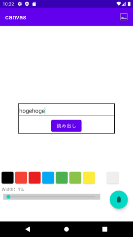
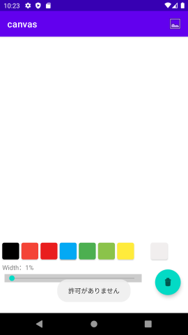

# :pencil: Canvas

## My other portfolio is here .
- 🎵[Music Player](https://github.com/TatsuyaHasunuma0123/MusicPlayer)
- 📆[Twitter Calender](https://github.com/TatsuyaHasunuma0123/Calendar)
- 🕸️[Discussion Web](https://github.com/TatsuyaHasunuma0123/Discuss)
  
## AndroidStudio setup
- Install the latest version from the [official AndroidStudio app](https://developer.android.com/studio). 
- **clone** this repositories and open project with AndroidStudio.  
**:collision: werning**: There is a possibility that it may not work depending on your environment.
```
git clone https://github.com/TatsuyaHasunuma0123/canvas
```

## Abstruct
　
  
**This application is including these functions:**
- Drawing
- Saveng
- Reading
  
## Drawing

- By tapping on the **colored square**, you can change the color of the pen.
- By manipulating the **bar**　that is displayed along with %, you can change the width of the pen .
  
## Saveing
      
 
  
1. Tapping the bar in the upper right corner will bring up a menu.
2. Tapping **save** button.
3. You can enter a name and save your drawing，and browsed popup.  

## Reading
 
1. Tapping the bar in upper right corner will bring up menu.
2. Tapping **browse** button.
3. You can enter a name and read your drawing, and browsed popup.
  
## Error
   
