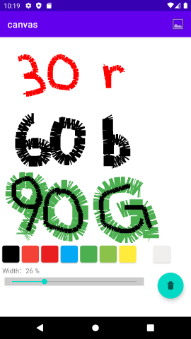

# Canvas

## My other portfolio is here.
- [Music Player](https://github.com/TatsuyaHasunuma0123/MusicPlayer)
- [Twitter Calender](https://github.com/TatsuyaHasunuma0123/Calendar)
- [Discussion Web](https://github.com/TatsuyaHasunuma0123/Discuss)


## AndroidStudio setup
- Install the latest version from the [official AndroidStudio app](https://developer.android.com/studio). 
- **clone** this repositories and OpenProject with AndroidStudio
```
git clone https://github.com/TatsuyaHasunuma0123/canvas
```

## Abstruct
　

This application is including this functions:
- Drawing
- Saveng
- Reading

### Drawing
You can draw anything

- By tapping on the ***colored square***, you can change the color of the pen.
- By manipulating the ***bar***　that is displayed along with %, you can change the width of the pen .

### Saving and Reading
You can save and load your drawings.
      

